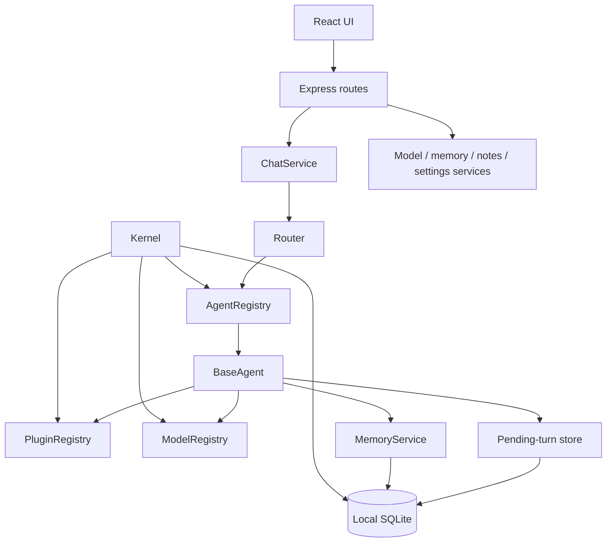
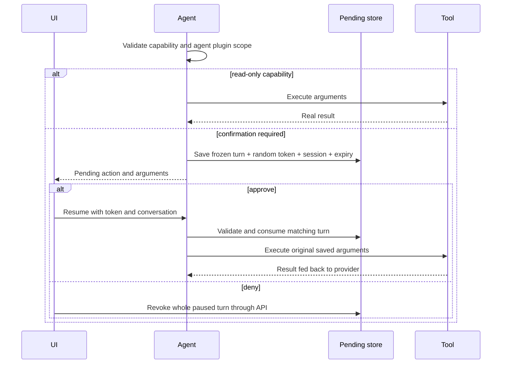

# Architecture

Luminary retains its React 18/TypeScript/Vite frontend and Express/TypeScript backend. Kernel startup creates agents, plugins and model providers; routes use application services rather than constructing providers directly.

## Layers and contracts

`backend/src/core/types` defines `IAgent`, `IPlugin`, `IModelProvider`, `IMemoryProvider`, and `IDevice`. Concrete implementations are composed in `core/kernel/Kernel.ts`. Registries provide lookup, capability discovery and lifecycle operations. `router/Router.ts` selects explicit agent assignments or uses `KeywordStrategy`; routing is deterministic keyword scoring, not an LLM planner.

`ChatService` owns conversation persistence and generation modes, adapts agent events into the HTTP NDJSON stream, and records completed messages. Conversations, settings, assignments and Discord bridge state use `JsonStore` beneath `backend/data/`. Notes, long-term memory, stored integration keys and pending tool turns use one SQLite database. `SystemService` reports actual host/registry information; the device registry starts empty until adapters register.

`BaseAgent` resolves the selected model/provider, builds identity + role + real system status + memory context, then invokes the provider. Tool-capable agents use the existing iterative tool loop. Tool-less providers receive an explicit unavailable-tools notice. The same execution path supports non-streaming router calls and streaming chat; reasoning deltas are not fabricated or persisted as final answers.

## Approval lifecycle

Tokens are agent- and conversation-bound, expire after 15 minutes, and are detached before execution. Unknown, expired or replayed tokens fail rather than starting a new model turn. Old pre-hardening paused turns lacking a conversation binding require a fresh request. Partial approval re-pauses the remaining calls. Denial revokes all tokens for that paused turn. Plugin `execute()` is an internal interface: the agent loop owns approval enforcement, while plugins own argument and path validation.

## Providers

`OllamaProvider` uses real HTTP requests, model discovery, NDJSON parsing, embeddings, and optional tool calling. Failed discovery never produces sample models. Stream errors and incomplete responses cannot become successful tool turns. `LocalProvider` discovers GGUF files and delegates native inference to `GgufRuntime`; its status depends on the real native runtime. A runtime-wide `ModelTaskQueue` serializes loading, generation, and disposal because GPU fallback may evict other models. Native hardware behavior still requires integration testing with real weights.

`CloudProvider` adapts the existing hosted wire formats using fixed provider endpoints and keys resolved from `SecretsService`. Enabling a cloud provider sends prompt/context/tool-result data to that provider. Tavily sends search terms externally; Discord uses an outbound gateway and checks the configured user before messages, commands, or approval buttons.

## Tool boundaries

`Sandbox` is the shared lexical/canonical confinement implementation for filesystem and native terminal inspection. It rejects traversal, symlinks, protected identity/memory paths, ambiguous drive-relative paths and NTFS stream names. File reads and writes have size caps; deletes do not recurse through nonempty directories. These checks do not isolate the backend from other local processes.

Terminal `exec` supports native `ls/cat/pwd/echo` and vetted read-only Git commands. Git uses `execFile` without a shell, rejects unexpected options, disables fsmonitor/pagers/external diff/text conversion, drops inherited Git environment overrides, and bounds process time and output. It does not run project builds or arbitrary scripts.

Model upload is a user API action rather than an agent tool: only safe `.gguf` names are accepted; raw bodies stream into unique exclusive temporary files, validate the magic header and size limit, then publish without replacing existing files. Header validation is not a full security validation of a native model file.

## Frontend boundary

`frontend/src/services/api.ts` supplies typed requests and NDJSON stream handling. Hooks keep remote state and expose honest errors. `ChatProvider` preserves generation and draft state across page/theme switches. The dashboard and Professional interface use the existing theme system. Model-change notifications currently use native EventSource, whose bearer-token limitation is documented in the README.

## Runtime and shutdown

The server defaults to loopback and checks Host/Origin before body parsing and authentication. Kernel boot opens SQLite, registers providers/agents/plugins, seeds or migrates identity files without overwriting existing content, watches model folders, and starts bounded memory/pending-turn expiry sweeps. Shutdown drains HTTP connections, disconnects Discord, stops watchers, unloads models, shuts plugins down, and closes SQLite.
