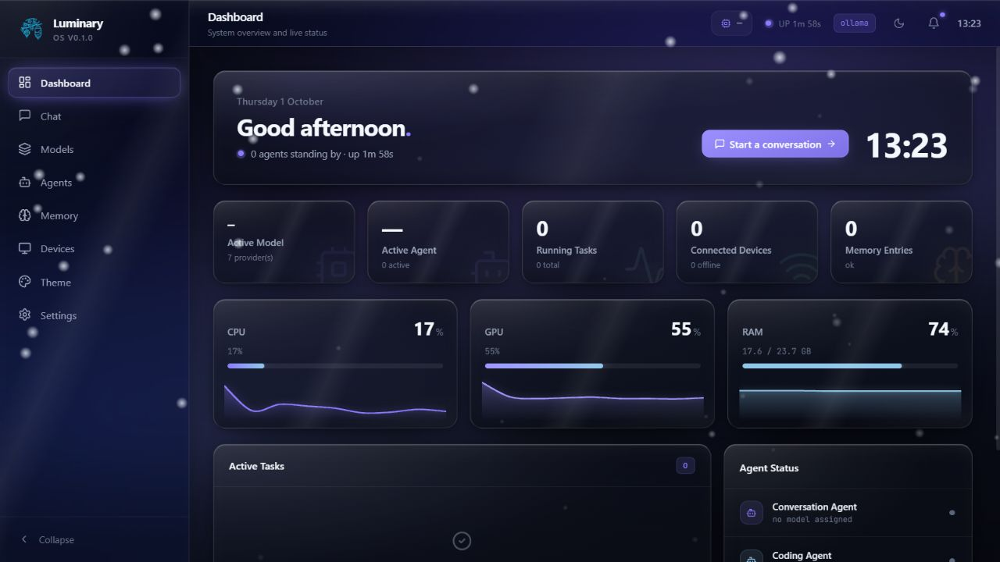
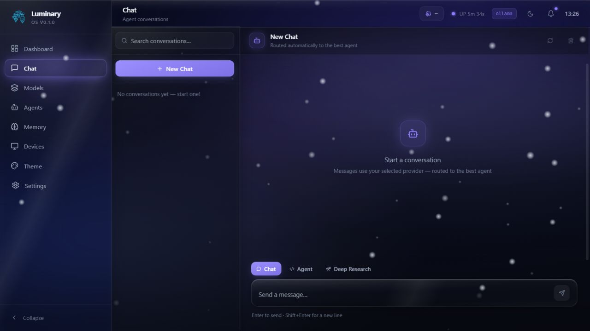
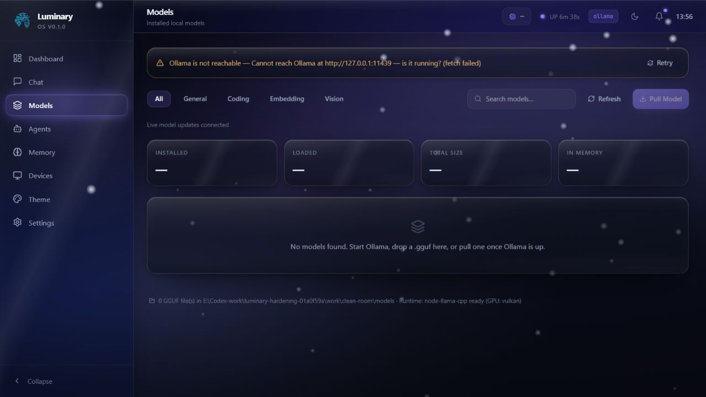
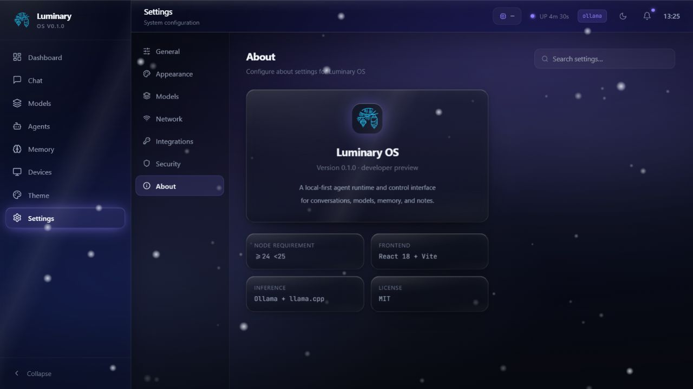
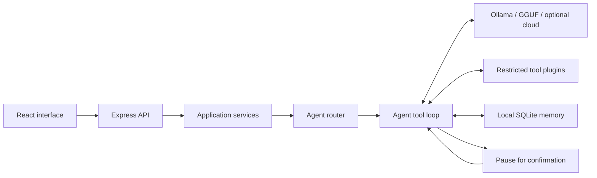

# Luminary OS

A local-first AI agent runtime and control interface for conversations, model routing, confirmation-gated tools, memory, and notes. Also known as **Lumen Civilian**.

  

**Status:** early developer preview, version 0.1.0. Windows installation and local API/UI operation are verified. Native inference and external integrations require their own configuration and validation. This is an agent application, not a replacement for the host operating system.



The screenshots below show real first-run states with no installed models or personal history. No generated responses or approval workflow are simulated.

<details>
<summary>Chat and model management</summary>






</details>

Luminary brings local models, specialist agents, system tools, conversations, and local storage into one interface. You can use Ollama without enabling a cloud provider. Cloud inference and search are optional and send data to their respective services when used.

## What is implemented

- Streaming conversations with stop, regeneration, continuation, persistent history, and real provider usage information where available.
- Conversation, Coding, Research, and Home agents; keyword routing and persistent model assignments. Coding and Research can use the iterative model → tool → result loop when the selected provider supports structured tools.
- Filesystem read/list/tree tools within configured roots. Writes and deletes require explicit approval; identity and curated memory files are protected.
- Restricted terminal inspection with `ls`, `cat`, `pwd`, `echo`, and selected Git inspection commands. Execution requires approval. Arbitrary shell commands, `node`, `npm`, process management, and PTY are not available.
- Ollama discovery, loading/unloading, model pull/delete, embeddings, and streaming. Local GGUF discovery and native inference through `node-llama-cpp`, subject to host compatibility.
- SQLite memory, notes, optional semantic recall, and persistent pending approvals. Missing embeddings produce an honest empty semantic result.
- Optional cloud adapters for OpenAI, Anthropic, Gemini, DeepSeek, and NVIDIA NIM; optional Tavily search and a Discord DM bridge restricted to one configured user. Live cloud/Discord operation is not verified by the offline test suite.
- Existing dashboard, model management, theme controls, and Professional chat interface.

## First run

Install **Node.js 24 LTS** and npm 10 or newer. Allow several GB of free disk space for native runtime binaries and the npm cache; the source repository is small, but its dependencies are larger. Use a terminal in this repository:

```sh
npm run setup
npm start
```

Setup installs from all three lockfiles and creates local `.env` files from the public examples. Startup runs the existing backend and Vite frontend and opens the interface. On Windows, `Other/setup.bat` and root `run.bat` provide the same flow. On macOS/Linux use `sh Other/setup.sh` and `sh Other/run.sh`; those platforms are not yet validated end to end.

Managed startup uses `http://127.0.0.1:5173` by default. Set `VITE_PORT` in the launcher environment to select another frontend port. The backend authorizes the exact origin opened by the launcher; an explicit `FRONTEND_URL` must be an HTTP localhost/127.0.0.1 origin on that same port. Mismatched addresses fail with instructions instead of weakening the origin guard. Open the displayed address when testing saves.

For local inference, install and start [Ollama](https://ollama.com), then pull a model you can run on your hardware:

```sh
ollama pull llama3.2:3b
# Optional semantic memory embeddings:
ollama pull nomic-embed-text
```

Select an installed model on the Models/Agents pages. Some models do not support tools; Luminary reports that limitation instead of pretending to execute them. You can also place trusted GGUF files in `models/`; weights are never included in the repository. No model download is needed to build or test the project.

Without Ollama or a runnable GGUF model, the UI still loads, displays provider availability, and returns a clear error for generation. It does not provide sample answers or fabricated models.

### Manual setup and verification

```sh
npm ci
npm ci --prefix backend
npm ci --prefix frontend
# Copy backend/.env.example to backend/.env and frontend/.env.example to frontend/.env,
# or let npm start create them.
npm run build
npm run lint
npm run typecheck
npm test
```

Run `npm run dev:backend` and `npm run dev:frontend` in separate terminals for development. Default API: `http://127.0.0.1:3001/api/health`; default UI: `http://localhost:5173`. `npm run doctor` reports local dependencies and provider availability.

The root launcher binds both services to loopback and waits for HTTP readiness. Set `PORT` and `VITE_PORT` in the launcher process environment to choose different ports; it forwards the backend port to Vite's proxy and the matching frontend origin to the API. Manual server commands use the component environment files.

## Architecture



The Kernel is the composition root; registries expose existing contracts for agents, plugins, and providers. See [ARCHITECTURE.md](ARCHITECTURE.md) and [extension guide](docs/extensions.md).

## Security and privacy

The API binds to loopback by default. HTTP Host and browser Origin checks run before request parsing; an explicit non-loopback bind requires an API token. `API_AUTH_TOKEN` enables bearer authentication for `/api` except the minimal health probe. Configure the matching `VITE_API_AUTH_TOKEN` for a private frontend build, or call the existing runtime token setter. A Vite variable becomes browser-visible code: never distribute a build containing a personal token. Live model notifications use the same bearer header, reconnect after network loss, and restart when the runtime token changes. Credentials are not put in event-stream URLs.

Tool arguments are untrusted. File access is limited to the sandbox plus explicitly configured `FILE_ALLOWED_DIRS`. Mutations pause for approval of a server-generated token tied to the agent and conversation. Tokens expire after 15 minutes and are consumed once; denial revokes the paused turn. Git commands disable executable configuration surfaces and use restricted options.

These controls are application policy, **not an operating-system isolation boundary**. A local process with access to the same files can still race filesystem checks or read runtime data. Browser URL opening and Windows media keys affect the host session. Keep allowed directories narrow, review tool arguments, and do not run Luminary as administrator.

Conversations, identity, curated memories, notes, keys, and models stay in local runtime folders unless you deliberately use a service that receives them. Integration keys are stored in **plaintext SQLite**, not an encrypted vault. The UI PIN/privacy blur is a convenience screen, not encryption or API authorization. `.env`, `Memory/`, `backend/data/`, model weights, dependency folders, and build output are ignored. See [SECURITY.md](SECURITY.md) before sharing a working directory.

## Limitations and experimental areas

- Device adapters/ESP32, WindowsPlugin operations, controlled browser page automation, process management, and PTY are incomplete. Their tools return explicit unavailable responses.
- Docker files under `Other/` and the component Dockerfiles are **experimental and unsupported for normal installation**. Do not use them as a deployment guide.
- GGUF hardware compatibility and live inference need testing with your models. GGUF discovery does not guarantee a file is safe or runnable; use trusted sources.
- Cloud adapters and Discord require credentials and may change upstream. Tests mock network boundaries; they do not certify every hosted model.
- Pages load on demand, and the full syntax-highlighting bundle is fetched only for language-tagged code. That optional bundle remains large; readable plaintext remains available if highlighting cannot load. UI accessibility and non-Windows coverage remain areas for improvement.
- MIT license text is provided, but the copyright-holder placeholder must be reviewed before publication.

## Development

Read [CONTRIBUTING.md](CONTRIBUTING.md) and the [feature verification matrix](docs/testing.md). Tests use Node's native runner with `tsx`; they exercise temporary files/SQLite, real local HTTP streaming, launcher processes and mocked model responses without Ollama, API keys, hardware, or model downloads. GitHub CI runs lint, tests, and builds on Windows and Linux; hosted execution remains unverified until publication.

Near-term priorities: wider tool-boundary tests, native inference integration tests with real models, a broader accessibility review, a maintained plugin example, and verified macOS/Linux setup. No dates are promised.

See [CHANGELOG.md](CHANGELOG.md) and [release checklist](docs/release-checklist.md). Licensed under [MIT](LICENSE).
